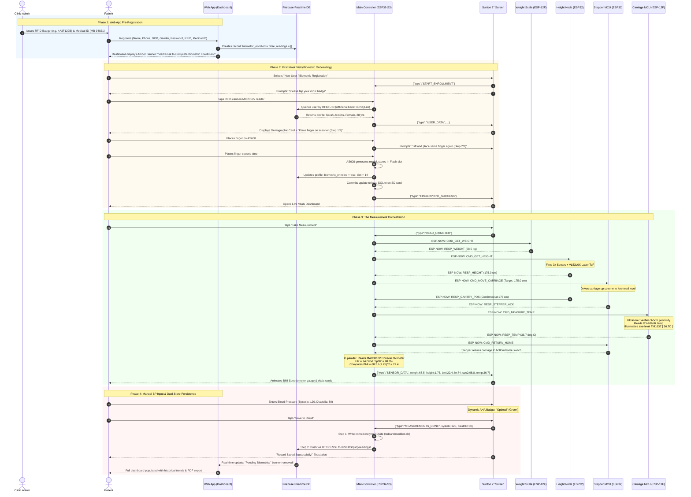
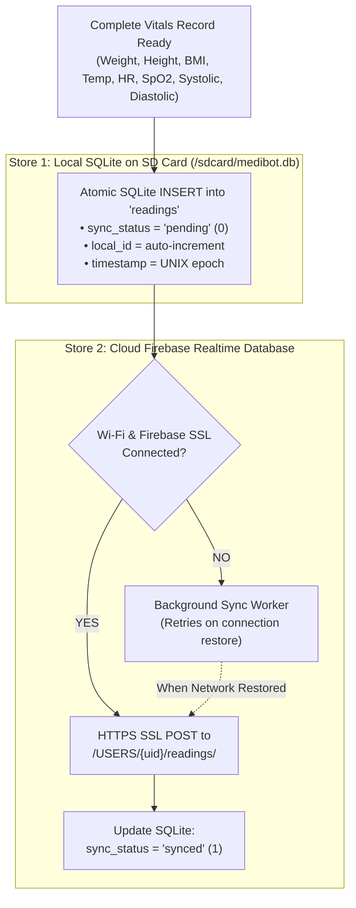

# MediBot Health Kiosk: Complete System Architecture Overview

> **Version:** 2.0  
> **Target Frameworks:** ESP-IDF v5.x (Master & Display) / Arduino & FreeRTOS (Distributed Peripherals)  
> **Author / Maintainer:** Idowu Oluwatimileyin (The_Shogunate) & Engineering Team  
> **Status:** Authoritative Architecture Reference

---

## 1. Executive Summary & Ecosystem Topology

The **MediBot Health Kiosk** is an autonomous, distributed clinical assessment kiosk engineered for unattended and semi-attended health vital screenings. The system integrates six (6) distinct microcontrollers, a cloud synchronization layer, a patient-facing web application, and a dual-store offline-resilient database architecture.

```mermaid
flowchart TD
    subgraph Cloud_And_Web["Cloud & Remote Layer"]
        Firebase[("Firebase Realtime Database\n(SSL Master Cloud)")]
        WebApp["Patient Web Application\n(React 18 + TypeScript + Tailwind)"]
        AdminPortal["Clinic Admin Portal\n(Badge & Medical ID Assignment)"]
        AdminPortal -->|Provision ID & Card UID| WebApp
        WebApp <-->|HTTPS REST / Auth| Firebase
    end

    subgraph Kiosk_Console["Central Kiosk Console (medic_bot_hardware)"]
        MainESP["Main Controller\n(ESP32-S3 Dual-Core 240MHz)\n• Master Orchestrator Engine\n• AS608 Biometric FP (UART)\n• MFRC522 RFID (SPI)\n• MAX30102 Pulse Ox (I2C)\n• Offline SQLite DB (/sdcard/medibot.db)"]
        SuntonLCD["7\" Touchscreen Display\n(Sunton ESP32-S3 800x480)\n• LVGL 9 Clinical Dashboard\n• Dynamic BMI Speedometer\n• Manual BP Entry & AHA Badge"]
        MainESP <==>|High-Speed UART (115200 baud)| SuntonLCD
        MainESP <-->|HTTPS SSL REST Sync| Firebase
    end

    subgraph Wireless_Peripherals["Distributed Peripheral Nodes (2.4 GHz ESP-NOW Master-Worker)"]
        HeightMCU["Height Subsystem\n(ESP-WROOM-32)\n• 3x Patient Sonars (Triangulation)\n• 1x Gantry Tracker Sonar\n• VL53L0X Laser ToF Sensor"]
        StepperMCU["Vertical Gantry Driver\n(ESP-WROOM-32)\n• TB6600 Motor Driver\n• NEMA Stepper Motor\n• Hardware Limit Switches"]
        WeightMCU["Weight Scale Base\n(ESP-12F / ESP8266)\n• 4x 50kg Load Cells\n• HX711 24-bit ADC"]
        TempMCU["Forehead Carriage\n(ESP-12F / ESP8266)\n• GY-906 (MLX90614) IR Temp\n• 20x4 I2C LCD Display\n• TM1637 4-Digit Eye-Level LED\n• Proximity Target Sonar"]
    end

    MainESP <==>|ESP-NOW: CMD_GET_WEIGHT / RESP_WEIGHT| WeightMCU
    MainESP <==>|ESP-NOW: CMD_GET_HEIGHT / RESP_HEIGHT| HeightMCU
    MainESP <==>|ESP-NOW: CMD_MOVE_CARRIAGE / RESP_ACK| StepperMCU
    MainESP <==>|ESP-NOW: CMD_MEASURE_TEMP / RESP_TEMP| TempMCU
```

---

## 2. Microcontroller Matrix & Hardware Specifications

The kiosk divides physical responsibilities across dedicated microcontrollers to guarantee deterministic real-time response, eliminate electrical noise, and avoid radio congestion:

| Node # | Subsystem Name | Microcontroller | Primary Interfaces & Sensors | Power Domain | Role Description |
|:---:|:---|:---|:---|:---:|:---|
| **MCU 1** | **Central Main Controller** | **ESP32-S3** (WROOM-1 / DevKitC-1) | • MFRC522 RFID (SPI)<br>• AS608 Fingerprint (UART2)<br>• MAX30102 Oximeter (I2C)<br>• MicroSD Card (SPI)<br>• Sunton Display (UART1)<br>• Wi-Fi (Firebase HTTPS) | 5V / 3A Dedicated PSU | Central state machine, authentication engine, dual-store persistence, and ESP-NOW master conductor. |
| **MCU 2** | **Interactive 7" Display** | **ESP32-S3** (Sunton 8048S070C) | • 800x480 16-bit RGB LCD<br>• GT911 Capacitive Touch<br>• 16MB Flash, 8MB Octal PSRAM<br>• High-Speed UART | 5V / 2A Console Bus | LVGL 9 clinical user interface, vitals visualization, on-screen manual blood pressure input, and toast alerts. |
| **MCU 3** | **Height Measurement Node** | **ESP-WROOM-32** | • VL53L0X Laser ToF (I2C: 21, 22)<br>• 3x Patient Sonars (12/13, 14/27, 26/25)<br>• 1x Gantry Tracker Sonar (33/32) | 5V Logic / 3.3V Core | 3-point acoustic triangulation + optical laser fusion for standing height; real-time tracking of gantry carriage height. |
| **MCU 4** | **Vertical Stepper Gantry** | **ESP-WROOM-32** | • TB6600 Driver (PUL, DIR, ENA)<br>• Limit Switches (Top & Bottom Home)<br>• NEMA Stepper Motor | 24V Motor / 5V Logic | Moves forehead carriage smoothly to patient eye/forehead level with acceleration profiling and safety interlocks. |
| **MCU 5** | **Weight Scale Platform** | **ESP-12F** (ESP8266) | • 4x Strain Gauge Load Cells<br>• HX711 24-bit ADC Amplifier | 5V Base Platform | Measures platform weight, runs 10-sample moving average, auto-tare, and weight stabilization confirmation. |
| **MCU 6** | **Forehead Temp Carriage** | **ESP-12F** (ESP8266) | • GY-906 (MLX90614) IR Temp (D1, D2)<br>• 20x4 I2C LCD (D1, D2)<br>• TM1637 4-Digit Display (D5, D6)<br>• Proximity Sonar (D8, D7) | 5V Flexible Carriage Cable | Mounted on moving gantry. Verifies 3–5 cm forehead distance, reads medical infrared temperature, and displays eye-level result. |

---

## 3. Detailed Hardware Pinouts & Wiring Specifications

### 3.1 MCU 1: Main Controller (ESP32-S3)
- **MFRC522 RFID (SPI)**:
  - `SCK`: GPIO 18
  - `MISO`: GPIO 19
  - `MOSI`: GPIO 23
  - `SDA / CS`: GPIO 5
  - `RST`: GPIO 22
- **AS608 Optical Fingerprint (UART)**:
  - `RX`: GPIO 16 (connected to AS608 TX)
  - `TX`: GPIO 17 (connected to AS608 RX)
- **MAX30102 Pulse Oximeter (I2C)**:
  - `SDA`: GPIO 8
  - `SCL`: GPIO 9
- **MicroSD Card Module (SPI)**:
  - `CS`: GPIO 10
  - `MOSI`: GPIO 11
  - `MISO`: GPIO 13
  - `SCK`: GPIO 12
- **Sunton 7" Display Communication (UART1)**:
  - `TX`: GPIO 43 (to Display RX)
  - `RX`: GPIO 44 (to Display TX)
  - `Baud`: 115200 bps

### 3.2 MCU 3: Height Subsystem (ESP-WROOM-32)
- **VL53L0X Time-of-Flight / Laser Distance**:
  - `SDA`: GPIO 21
  - `SCL`: GPIO 22
- **Patient Height Ultrasonic Array (3-Point Triangulation)**:
  - `Sonar 1 (Left)`: Trig = GPIO 12, Echo = GPIO 13
  - `Sonar 2 (Center)`: Trig = GPIO 14, Echo = GPIO 27
  - `Sonar 3 (Right)`: Trig = GPIO 26, Echo = GPIO 25
- **Gantry Carriage Height Tracker**:
  - `Sonar 4 (Gantry)`: Trig = GPIO 33, Echo = GPIO 32

### 3.3 MCU 4: Stepper Gantry (ESP-WROOM-32)
- **TB6600 Stepper Driver**:
  - `PUL+` (Step): GPIO 18
  - `DIR+` (Direction): GPIO 19
  - `ENA+` (Enable): GPIO 21
- **Hardware Safety Limit Switches**:
  - `Bottom Home Switch`: GPIO 4 (Active LOW with internal pull-up)
  - `Top Safety Limit Switch`: GPIO 5 (Active LOW with internal pull-up)

### 3.4 MCU 5: Weight Platform (ESP-12F / ESP8266)
- **HX711 24-Bit Amplifier**:
  - `DOUT`: GPIO 4 (D2)
  - `SCK`: GPIO 5 (D1)
  - `Calibration Factor`: Tuned to platform tare

### 3.5 MCU 6: Forehead Temperature Carriage (ESP-12F / ESP8266)
- **GY-906 (MLX90614) Non-Contact IR Sensor & 20x4 I2C LCD**:
  - `SCL`: GPIO 5 (D1)
  - `SDA`: GPIO 4 (D2)
  - `LCD I2C Address`: `0x27` (or `0x3F`)
  - `MLX90614 I2C Address`: `0x5A`
- **TM1637 4-Digit 7-Segment Display**:
  - `CLK`: GPIO 14 (D5)
  - `DIO`: GPIO 12 (D6)
- **Forehead Proximity Guidance Sonar**:
  - `Trig`: GPIO 15 (D8)
  - `Echo`: GPIO 13 (D7)

---

## 4. Master-Worker Communication Protocol

### 4.1 Distributed ESP-NOW Protocol (24-Byte Fixed Binary Struct)
All peripheral nodes communicate with the Main Controller using a standardized 24-byte packet. Idle nodes never broadcast spontaneously, keeping the 2.4 GHz airwaves silent.

```c
typedef enum {
    NODE_MAIN_CONTROLLER = 0x00,
    NODE_WEIGHT_SCALE    = 0x01,
    NODE_HEIGHT_SONAR    = 0x02,
    NODE_STEPPER_GANTRY  = 0x03,
    NODE_TEMP_CARRIAGE   = 0x04
} espnow_node_id_t;

typedef enum {
    CMD_PING             = 0x10,
    CMD_GET_WEIGHT       = 0x20,
    CMD_GET_HEIGHT       = 0x30,
    CMD_GET_GANTRY_POS   = 0x35,
    CMD_MOVE_CARRIAGE    = 0x40,
    CMD_MEASURE_TEMP     = 0x50,
    CMD_RETURN_HOME      = 0x60,
    CMD_EMERGENCY_HALT   = 0xEE,
    RESP_WEIGHT          = 0x81,
    RESP_HEIGHT          = 0x82,
    RESP_STEPPER_ACK     = 0x83,
    RESP_TEMP            = 0x84,
    RESP_ERROR           = 0xFF
} espnow_cmd_t;

typedef struct __attribute__((packed)) {
    uint8_t magic;         // 0xMB (0x4D, 0x42)
    uint8_t src_node;      // espnow_node_id_t
    uint8_t dest_node;     // espnow_node_id_t
    uint8_t opcode;        // espnow_cmd_t
    uint16_t seq;          // Rolling sequence counter
    uint8_t status;        // 0 = OK, >0 = Error code
    uint8_t reserved;
    union {
        float weight;
        float height;
        float temperature;
        struct {
            float target_height_cm;
            uint16_t speed;
            uint16_t microsteps;
        } stepper_cmd;
        uint8_t raw_payload[16];
    } data;
} espnow_kiosk_packet_t;
```

### 4.2 UART Protocol (Main Controller <==> Sunton 7" Screen)
Communication between the Main Controller and the Sunton 7" display is strictly newline-delimited JSON (`\n` terminated):

| Direction | Type | Example Payload | Description |
|:---|:---|:---|:---|
| **Main -> Display** | `BOOT_PROGRESS` | `{"type":"BOOT_PROGRESS","percent":80,"task":"Sensors OK","core":2,"wifi":2,"cloud":2,"sensors":2}` | Boot diagnostic progress |
| **Main -> Display** | `USER_DATA` | `{"type":"USER_DATA","user_name":"Sarah Jenkins","user_medical_id":"MB-94021","user_age":"28 yrs","user_gender":"Female"}` | Demographics after RFID scan |
| **Main -> Display** | `SENSOR_DATA` | `{"type":"SENSOR_DATA","weight":68.5,"height":1.75,"bmi":22.4,"heart_rate":74.0,"spo2":98.8,"temperature":36.7}` | Orchestrated readings |
| **Main -> Display** | `CARD_DETECTED` | `{"type":"CARD_DETECTED","uid":"4A3F129B"}` | Notification that badge tapped |
| **Main -> Display** | `FINGERPRINT_PROMPT` | `{"type":"FINGERPRINT_PROMPT","step":1,"msg":"Place finger on scanner"}` | Biometric enrollment step |
| **Main -> Display** | `FINGERPRINT_SUCCESS`| `{"type":"FINGERPRINT_SUCCESS","slot":14}` | Biometric enrolled / verified |
| **Display -> Main** | `START_LOGIN` | `{"type":"START_LOGIN"}` | User pressed "Existing User" |
| **Display -> Main** | `START_ENROLLMENT` | `{"type":"START_ENROLLMENT"}` | User pressed "New User" |
| **Display -> Main** | `READ_OXIMETER` | `{"type":"READ_OXIMETER"}` | User tapped "Take Measurement" |
| **Display -> Main** | `MEASUREMENTS_DONE` | `{"type":"MEASUREMENTS_DONE","systolic":120,"diastolic":80}` | User tapped "Save to Cloud" |
| **Display -> Main** | `LOGOUT` | `{"type":"LOGOUT"}` | User ended session |

---

## 5. End-to-End Clinical Lifecycle & Workflow



---

## 6. Dual-Store Persistence Architecture (Offline-First)

The MediBot Kiosk operates under strict clinical continuity requirements: patient assessments must never fail or lose data during internet outages or power transients.



### Unified SQLite Schema
```sql
CREATE TABLE IF NOT EXISTS patients (
    medical_id TEXT PRIMARY KEY,
    rfid_uid TEXT UNIQUE,
    name TEXT,
    email TEXT,
    phone TEXT,
    dob TEXT,
    gender TEXT,
    biometric_enrolled INTEGER DEFAULT 0,
    fingerprint_slot INTEGER,
    created_at INTEGER
);

CREATE TABLE IF NOT EXISTS vitals (
    id INTEGER PRIMARY KEY AUTOINCREMENT,
    medical_id TEXT,
    timestamp INTEGER,
    weight_kg REAL,
    height_cm REAL,
    bmi REAL,
    heart_rate_bpm REAL,
    spo2_pct REAL,
    temperature_c REAL,
    systolic_mmhg INTEGER,
    diastolic_mmhg INTEGER,
    aha_category TEXT,
    sync_status INTEGER DEFAULT 0,
    FOREIGN KEY(medical_id) REFERENCES patients(medical_id)
);
```

---

## 7. Safety Interlocks & Fail-Safe Mechanics

1. **Weight Departure Emergency Interlock**:
   - The Stepper Motor MCU is locked in disable mode unless the Scale MCU detects at least 40.0 kg on the platform.
   - If a patient steps off the scale during carriage motion (< 10.0 kg), the Main Controller issues an immediate `CMD_EMERGENCY_HALT` via ESP-NOW, causing the stepper driver to cut motor coils instantly.
2. **Hardware Boundary Protection**:
   - Upper and lower physical optical/microswitch limit switches are wired directly to the Stepper MCU. If triggered, motor pulses are cut at the hardware interrupt level, regardless of software state.
3. **Acoustic Staggering (Anti-Cross-Talk)**:
   - The three patient ultrasonic sensors (Pins 12/13, 14/27, 26/25) are pulsed sequentially with an intentional 15 ms delay between triggers to prevent overlapping reflections from causing false height calculations.
4. **RF Collision Immunity**:
   - Because the Main Controller conducts all ESP-NOW traffic in strict request-response pairs, only one node transmits at any single point in time, eliminating packet collisions on the 2.4 GHz band.
